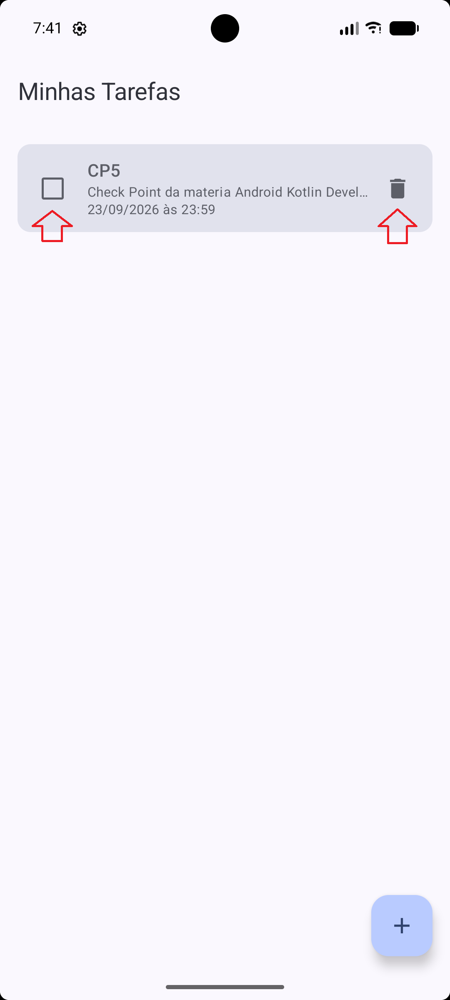
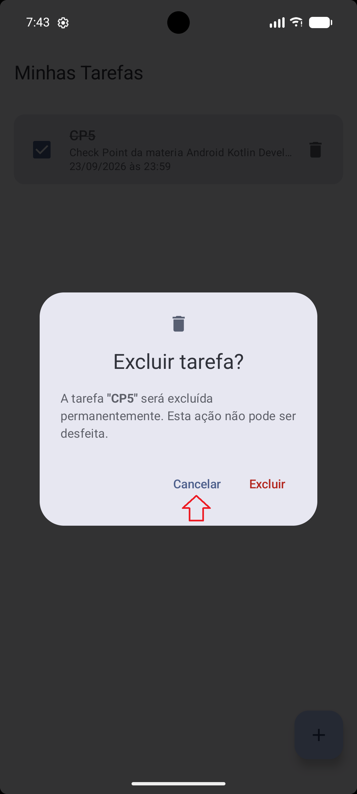
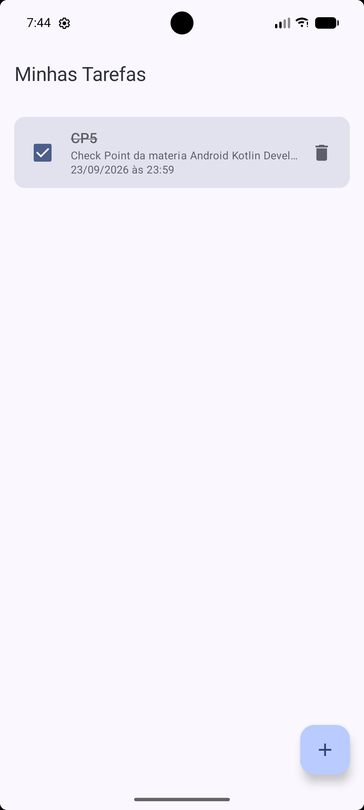
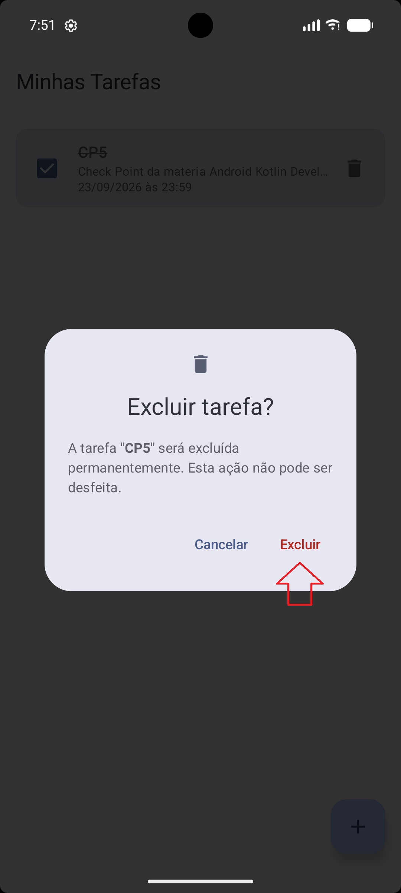
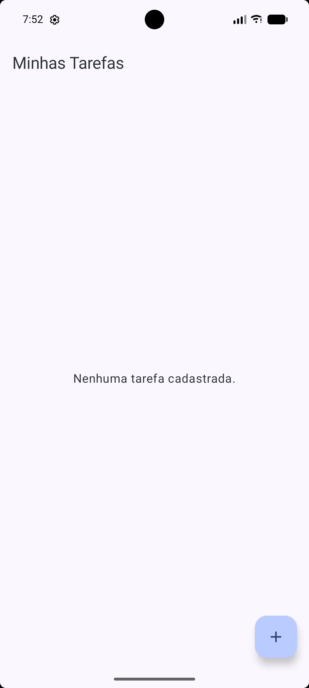

# Evidências — Confirmação de exclusão de tarefas

Este documento apresenta, em sequência, as capturas do emulador que demonstram o fluxo de confirmação de exclusão implementado com um `AlertDialog` do Jetpack Compose Material 3, exibido sobre a tela da lista de tarefas.

## Implementação resumida

| Arquivo | Alteração |
|---|---|
| `ui/ConfirmarExclusaoDialog.kt` | Novo componente `ConfirmarExclusaoDialog` (Material 3 `AlertDialog`) com o título da tarefa e os botões **Cancelar** e **Excluir**, além de uma `@Preview`. |
| `ui/ListaTarefasScreen.kt` | O ícone de lixeira passa a abrir o diálogo; o diálogo é renderizado sobre a lista. Nova `@Preview` "Lista com confirmação de exclusão". |
| `viewmodel/TarefaViewModel.kt` | Novo estado `tarefaParaExcluir` (`StateFlow<Tarefa?>`) e as funções `solicitarExclusao`, `cancelarExclusao` e `confirmarExclusao`. |

A tarefa selecionada fica guardada na ViewModel enquanto o diálogo está aberto. Ao confirmar, somente essa tarefa é enviada ao `TarefaRepository` para exclusão; ao cancelar, o estado é limpo e a lista não é alterada.

## 1. Lista antes da exclusão

A lista exibe a tarefa **CP5** com prazo em 23/09/2026 às 23:59. As setas indicam o checkbox de conclusão e o ícone de lixeira que abre a confirmação.

## 2. Diálogo aberto com a tarefa selecionada

Ao tocar na lixeira, o diálogo Material 3 aparece sobre a lista e mostra o título da tarefa selecionada (**"CP5"**). A seta indica o botão **Cancelar**, que será acionado.

## 3. Resultado ao cancelar

O diálogo foi fechado e a tarefa **CP5** continua na lista, sem nenhuma alteração.

## 4. Nova abertura do diálogo

A lixeira foi tocada novamente e o diálogo reabriu para a mesma tarefa. A seta indica o botão **Excluir**, que será acionado.

## 5. Resultado após confirmar a exclusão

Somente a tarefa selecionada (**CP5**) foi removida. Como era a única tarefa, a lista exibe a mensagem "Nenhuma tarefa cadastrada."

